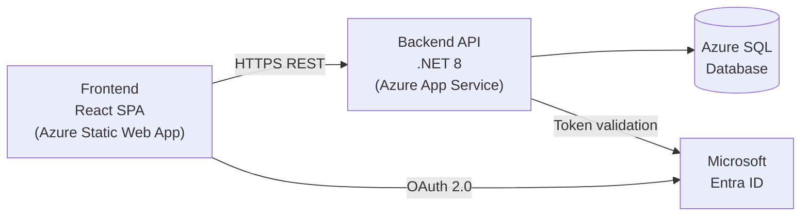

# Step 3 — Generate Technical Design Document (TDD)

## Prerequisites
- `output/02-fsd-<project-name>.md` must exist.
- Template: `templates/tdd_template.md`

## Instructions

1. Read `output/02-fsd-<project-name>.md`.
2. Read `templates/tdd_template.md`.
3. Infer a **recommended tech stack** based on the project type. If the BRD mentions specific technologies, use them. Otherwise, recommend modern, Azure-deployable defaults:
   - **Frontend**: React + TypeScript (or Angular / Vue if specified)
   - **Backend**: .NET 8 Web API or Node.js (Express/Fastify)
   - **Database**: Azure SQL Database or Cosmos DB (based on data shape)
   - **Auth**: Microsoft Entra ID (Azure AD)
   - **Hosting**: Azure App Service + Azure Static Web Apps
   - **CI/CD**: GitHub Actions
4. Generate the following TDD sections:
   - **System Architecture Diagram** (Mermaid `graph LR` or `C4Context` style)
   - **Component Breakdown** (frontend, backend, DB, integrations)
   - **Database Schema** (entity tables with key columns, PK/FK relationships)
   - **API Endpoint Catalogue** (method, path, request/response shape, auth required)
   - **Authentication & Authorization Design**
   - **Azure Resource Map** (which Azure services are used and why)
   - **Non-Functional Design** (caching, Rate limiting, retry policies)
   - **Security Considerations** (OWASP Top 10 relevant items)
   - **Deployment Architecture** (Mermaid diagram)
5. Each TDD section that implements an FSD requirement must include a reference `→ FSD-FR-xx`.
6. Save as `output/03-tdd-<project-name>.md`.

## Architecture Diagram Example (Mermaid)



## API Catalogue Format

```markdown
### POST /api/auth/login
- **Auth**: Public
- **Request**: `{ email: string, password: string }`
- **Response (200)**: `{ token: string, expiresIn: number }`
- **Response (401)**: `{ error: "INVALID_CREDENTIALS" }`
- **Implements**: FSD-FR-03
```

After saving, confirm: "TDD generated. Architecture defined, X API endpoints catalogued. Proceed to Step 4 (WBS)."
