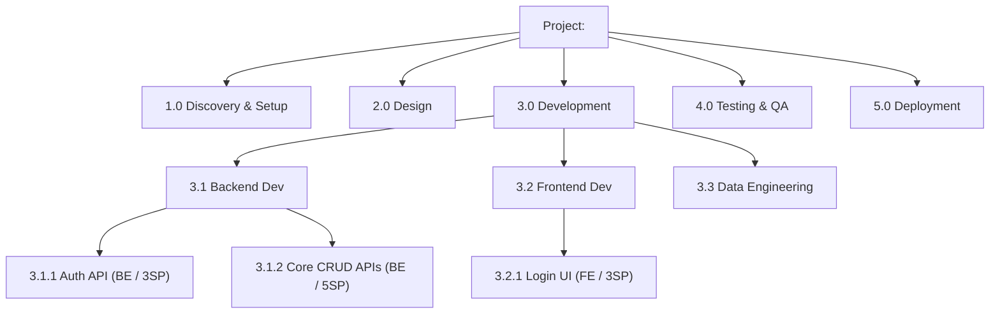

# Step 4 — Generate Work Breakdown Structure (WBS)

## Prerequisites
- `output/02-fsd-<project-name>.md` and `output/03-tdd-<project-name>.md` must exist.
- Template: `templates/wbs_template.md`

## Instructions

1. Read both the FSD and TDD from `output/`.
2. Read `templates/wbs_template.md`.
3. Break down the project into a **3-level WBS**:
   - **Level 1**: Project Phases (e.g., `1.0 Discovery`, `2.0 Design`, `3.0 Development`, `4.0 Testing`, `5.0 Deployment`)
   - **Level 2**: Work Packages (e.g., `3.1 Backend Development`, `3.2 Frontend Development`)
   - **Level 3**: Individual Tasks (e.g., `3.1.1 Implement auth API endpoints`)
4. For each Level 3 task, provide:
   - **Task ID** (WBS-xxx format, e.g., `WBS-031`)
   - **Description**
   - **Assigned Persona** (`Frontend Engineer` / `Backend Engineer` / `Data Engineer` / `Data Analyst` / `SRE/Cloud Engineer`)
   - **Effort estimate** (Story Points or days — use Fibonacci for SP: 1, 2, 3, 5, 8, 13)
   - **FSD/TDD Reference** (e.g., `→ FSD-FR-05`, `→ TDD-API-03`)
   - **Dependencies** (other WBS task IDs this depends on)
5. Generate a visual WBS tree using Mermaid.
6. Add a **Summary Table** with total effort per persona and per phase.
7. Save as `output/04-wbs-<project-name>.md`.

## WBS Tree Example (Mermaid)

## Effort Summary Table Format

| Persona | Phase 1 | Phase 2 | Phase 3 | Phase 4 | Phase 5 | Total SP |
|---------|---------|---------|---------|---------|---------|----------|
| Frontend Engineer | 2 | 5 | 21 | 8 | 2 | 38 |
| Backend Engineer | 2 | 8 | 34 | 10 | 3 | 57 |
| Data Engineer | 1 | 3 | 13 | 5 | 2 | 24 |
| Data Analyst | 0 | 2 | 8 | 3 | 1 | 14 |
| SRE / Cloud Engineer | 3 | 5 | 5 | 3 | 8 | 24 |
| **Total** | **8** | **23** | **81** | **29** | **16** | **157** |

After saving, confirm: "WBS generated. X tasks across Y phases, total Z story points. Proceed to Step 5 (PM Plan)."
