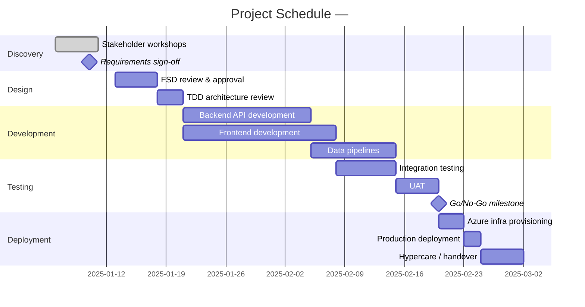

# Step 5 — Generate Project Management Plan

## Prerequisites
- `output/04-wbs-<project-name>.md` must exist.
- Template: `templates/pm_plan_template.md`

## Instructions

Read the WBS from `output/04-wbs-<project-name>.md` and read `templates/pm_plan_template.md`, then generate three interlinked sub-documents as one file:

---

### Part A — Project Schedule (Gantt Chart)

1. Use WBS phases and work packages to build a Gantt chart in **Mermaid `gantt` syntax**.
2. Assume project start date = **today's date** (or as specified in the BRD).
3. Estimate durations based on WBS story points (1 SP ≈ 1 day for a single person; adjust for team size).
4. Mark **milestones** at the end of each phase.
5. Identify the **critical path** (sequence of tasks with no slack).

---

### Part B — Risk Register

Generate a risk register with at least **10 realistic risks** for the project.
For each risk:
- **Risk ID** (RISK-01, RISK-02 …)
- **Category** (Technical / People / Schedule / External / Security)
- **Description**
- **Probability** (Low / Medium / High)
- **Impact** (Low / Medium / High)
- **Risk Score** = Probability × Impact (as 3×3 matrix: Low=1, Med=2, High=3)
- **Mitigation Strategy**
- **Owner Persona**
- **Status** (Open / Mitigated / Accepted)

---

### Part C — Communication Plan

| Audience | Meeting/Event | Frequency | Format | Owner |
|----------|---------------|-----------|--------|-------|
| Project Sponsor | Steering Committee | Bi-weekly | Slide deck + live demo | PM |
| Dev Team | Sprint Planning | Bi-weekly | Backlog grooming in GitHub | Tech Lead |
| Dev Team | Daily Standup | Daily | 15-min call | Scrum Master |
| Dev Team | Sprint Retrospective | Bi-weekly | Miro board | Scrum Master |
| Stakeholders | Demo Day | End of each sprint | Live demo | PM + Dev Team |
| All | Risk Review | Monthly | Risk Register walkthrough | PM |
| Client | Weekly Status Report | Weekly | Email summary | PM |

---

Save as `output/05-pm-plan-<project-name>.md`.

After saving, confirm: "PM Plan generated. Gantt chart with X milestones, Y risks identified, communication plan for Z audiences. Proceed to Step 6 (UI Prototype)."
