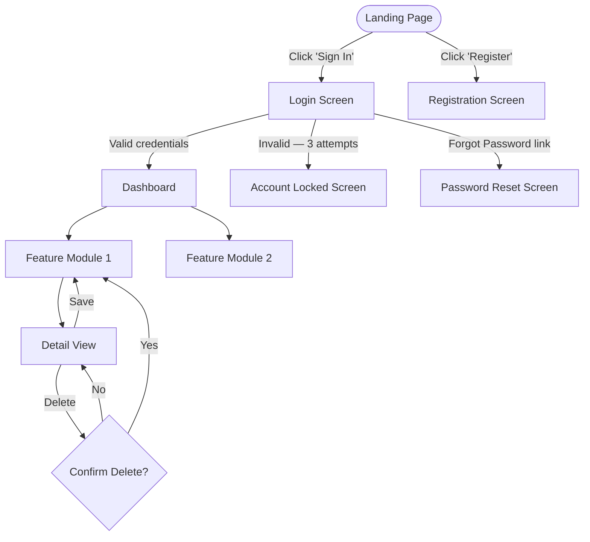

# Step 6 — Generate UI Prototype

## Prerequisites
- `output/02-fsd-<project-name>.md` must exist.
- Template: `templates/ui_prototype_template.md`

## Instructions

Read the FSD from `output/02-fsd-<project-name>.md` and identify all **screens / views** mentioned.
Read `templates/ui_prototype_template.md` for structure.

Then produce **three layers** of UI prototype artefacts:

---

### Layer 1 — User Flow Diagram (Mermaid)

Map every screen and the transitions between them.



---

### Layer 2 — Screen Wireframes (ASCII/Markdown)

For each **key screen**, provide an ASCII wireframe and a description.
Minimum screens to cover: Login, Main Dashboard, Primary Feature Screen, Settings/Profile.

Format:

```
┌─────────────────────────────────────────────────────┐
│  SCREEN: Login                                       │
├─────────────────────────────────────────────────────┤
│                                                      │
│   ┌──────────────────────────────────────────┐      │
│   │  🏢 [Company Logo]                       │      │
│   └──────────────────────────────────────────┘      │
│                                                      │
│   Email Address                                      │
│   ┌──────────────────────────────────────────┐      │
│   │  user@company.com                        │      │
│   └──────────────────────────────────────────┘      │
│                                                      │
│   Password                                           │
│   ┌──────────────────────────────────────────┐      │
│   │  ••••••••••••••  [👁 Show]               │      │
│   └──────────────────────────────────────────┘      │
│                                                      │
│   ┌──────────────────────────────────────────┐      │
│   │           SIGN IN                        │      │  ← Primary CTA
│   └──────────────────────────────────────────┘      │
│                                                      │
│   [Forgot Password?]              [Register →]       │
│                                                      │
│   ── Or sign in with ──                              │
│   [ Microsoft ]  [ Google ]                         │
└─────────────────────────────────────────────────────┘
```

---

### Layer 3 — Minimal HTML Prototype

Generate a **single self-contained HTML file** (`output/06-ui-prototype-<project-name>.html`) with:
- Inline CSS (use a clean, neutral design — white background, blue primary colour `#0078D4`, Inter font via CDN)
- JavaScript for navigation between screens (no frameworks — pure vanilla JS)
- At minimum these screens as `<div>` sections, shown/hidden via JS: 
  1. Login screen
  2. Dashboard / Home screen
  3. At least one primary feature screen from the FSD
- Responsive layout (CSS flexbox/grid, mobile-aware)
- Placeholder data where needed (use realistic-looking sample data, not "Lorem ipsum")
- A top navigation bar with the project name
- **No external dependencies except Google Fonts CDN** (keep it distributable as a single file)

The HTML prototype is for **demonstration purposes only** — label it clearly with a banner:
```html
<div class="prototype-banner">⚠️ UI PROTOTYPE — For Demonstration Only</div>
```

---

### Output Files
1. `output/06-ui-wireframes-<project-name>.md` — Flow diagram + ASCII wireframes
2. `output/06-ui-prototype-<project-name>.html` — Clickable HTML prototype

After saving, confirm: "UI Prototype generated. X screen wireframes, HTML prototype saved. Proceed to Step 7 (Persona TODOs)."
