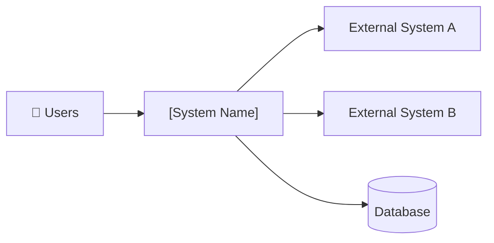

# Functional Specification Document (FSD)
# Project: [PROJECT NAME]

| Field | Value |
|-------|-------|
| **Document Version** | 1.0 |
| **Date** | [DATE] |
| **Author** | [AUTHOR] |
| **Status** | Draft |
| **BRD Reference** | `intake/[brd-filename]` |
| **Next Review** | [DATE] |

---

## Table of Contents
1. [Document Purpose](#1-document-purpose)
2. [System Overview](#2-system-overview)
3. [User Roles & Permissions](#3-user-roles--permissions)
4. [Feature Modules](#4-feature-modules)
5. [Data Dictionary](#5-data-dictionary)
6. [Integration Points](#6-integration-points)
7. [Glossary](#7-glossary)

---

## 1. Document Purpose

This Functional Specification Document (FSD) translates the Business Requirements (BRD) into
detailed, screen-level functional requirements. It is the primary reference for:
- **Developers** building the system
- **QA Engineers** writing test cases
- **Stakeholders** verifying the system matches business needs

Every requirement in this document traces back to a BRD requirement (noted as `→ BRD-FR-xx`).

---

## 2. System Overview

### 2.1 Product Description
[One paragraph description of what the system does]

### 2.2 System Context Diagram


### 2.3 Key Design Principles
- [Principle 1, e.g., Mobile-first responsive design]
- [Principle 2, e.g., Offline-capable for field workers]
- [Principle 3, e.g., Single Sign-On via Entra ID]

---

## 3. User Roles & Permissions

| Role | Description | Key Capabilities |
|------|-------------|-----------------|
| [Role 1] | [Description] | [Can do X, Y, Z] |
| [Role 2] | [Description] | [Can do A, B, C] |

### 3.1 Permission Matrix

| Feature | [Role 1] | [Role 2] | [Role 3] |
|---------|---------|---------|---------|
| [Feature A] | ✅ Full | 👁 Read only | ❌ No access |
| [Feature B] | ✅ Full | ✅ Full | 👁 Read only |

---

## 4. Feature Modules

---

### Module 1: [MODULE NAME]
*BRD References: BRD-FR-01, BRD-FR-02*

#### FSD-FR-01 · [Requirement Title]
→ `BRD-FR-01`

**Description:**
[Detailed functional description — what exactly the system does, field by field, step by step]

**User Story:**
> As a **[persona]**, I want to **[action]** so that **[benefit]**.

**Acceptance Criteria:**
- [ ] Given [precondition], when [action], then [expected outcome]
- [ ] Given [precondition], when [action], then [expected outcome]
- [ ] [Error scenario]: When [bad input], then [error message/behaviour]

**UI Description:**
```
[ASCII wireframe or text description of the screen/component]
- Field: [Name] — Type: [text/select/date] — Validation: [rules]
- Field: [Name] — Type: [text/select/date] — Validation: [rules]
- Button: [Label] — Enabled when: [condition]
```

**Business Rules:**
| Rule ID | Rule Description |
|---------|-----------------|
| BR-01-01 | [Business rule, e.g., "Email must be unique in the system"] |
| BR-01-02 | [Business rule] |

**Error States:**
| Error Code | Trigger | Message Shown to User |
|------------|---------|----------------------|
| ERR-01-001 | [Condition] | "[User-friendly error message]" |

---

#### FSD-FR-02 · [Next Requirement]
→ `BRD-FR-02`

[Repeat pattern above for each requirement in this module]

---

### Module 2: [MODULE NAME]
*BRD References: BRD-FR-03, BRD-FR-04*

[Repeat module pattern]

---

## 5. Data Dictionary

### 5.1 Core Entities

#### Entity: [EntityName]
| Field | Type | Required | Validation | Description |
|-------|------|----------|-----------|-------------|
| `id` | UUID | Yes | Auto-generated | Primary key |
| `[field1]` | String | Yes | Max 255 chars | [Description] |
| `[field2]` | Decimal(10,2) | Yes | > 0 | [Description] |
| `[field3]` | Enum | Yes | [Values] | [Description] |
| `created_at` | DateTime | Yes | Auto-set | Record creation timestamp |
| `updated_at` | DateTime | Yes | Auto-updated | Last modification timestamp |

**Relationships:**
- `[EntityName]` belongs to `[OtherEntity]` (many-to-one)
- `[EntityName]` has many `[OtherEntity2]`

---

## 6. Integration Points

| Integration | Type | Direction | Frequency | Protocol | Auth Method |
|------------|------|-----------|-----------|----------|-------------|
| [System A] | [REST API / SFTP / Event] | Inbound / Outbound | [Real-time / Daily / On-demand] | HTTPS | [OAuth 2.0 / API Key] |
| [System B] | [REST API] | Outbound | Real-time | HTTPS | API Key |

### 6.1 [Integration Name] — Detail
- **Purpose**: [Why this integration exists]
- **Data Exchanged**: [What data flows]
- **Error Handling**: [What happens if integration fails]
- **FSD Reference**: FSD-FR-xx

---

## 7. Glossary

| Term | Definition |
|------|-----------|
| [Term 1] | [Definition] |
| [Term 2] | [Definition] |

---

*Generated by GitHub Copilot PM Spec-Kit*
