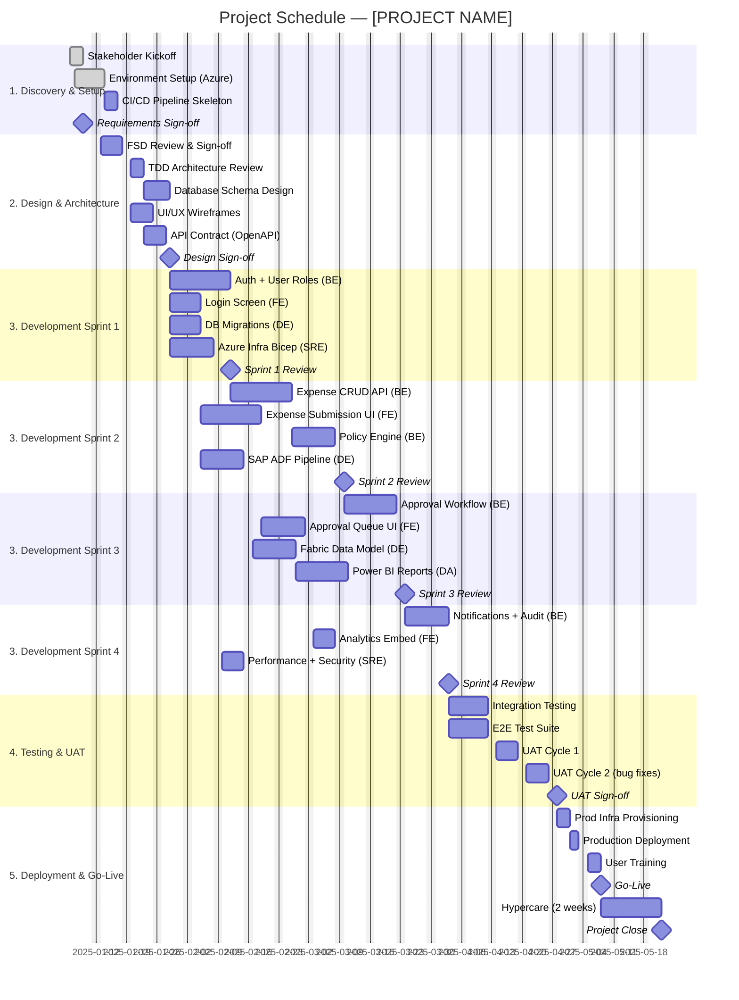

# Project Management Plan
# Project: [PROJECT NAME]

| Field | Value |
|-------|-------|
| **Version** | 1.0 |
| **Date** | [DATE] |
| **Project Manager** | [NAME] |
| **WBS Reference** | `output/04-wbs-[project-name].md` |
| **Project Start Date** | [DATE] |
| **Target Go-Live** | [DATE] |

---

## Part A — Project Schedule (Gantt Chart)



### Critical Path
The critical path runs through:
`FSD Sign-off → TDD Review → DB Schema → Auth API → Expense CRUD → Policy Engine → Approval Workflow → Integration Testing → UAT → Production Deployment`

Delays in any of these items **directly delay** the Go-Live date.

---

## Part B — Risk Register

| ID | Category | Risk Description | Probability | Impact | Score | Mitigation Strategy | Owner | Status |
|----|----------|-----------------|-------------|--------|-------|---------------------|-------|--------|
| RISK-01 | Technical | OCR accuracy is below acceptable threshold (< 85% confidence), requiring extensive manual correction | Medium | High | 6 | Evaluate Azure AI Document Intelligence on sample receipts in Sprint 1. Define fallback to fully manual entry if accuracy < 80%. | Backend Engineer | Open |
| RISK-02 | External | SAP HR system does not expose a suitable API/SFTP feed for integration | Low | High | 3 | Confirm SAP integration spec with IT in Week 1. Fallback: manual CSV upload of employee data. | Data Engineer | Open |
| RISK-03 | Schedule | Frontend and Backend development timelines depend on FSD/TDD being finalised; any delay cascades | High | High | 9 | Fast-track FSD/TDD reviews. Run parallel design sessions. Accept FSD v0.9 to unblock dev if needed. | PM | Open |
| RISK-04 | People | Key backend engineer leaves mid-project | Low | High | 3 | Pair programming, documentation on all key components. Knowledge transfer sessions every sprint. | PM | Open |
| RISK-05 | Technical | Power BI Embedded licensing access delayed (procurement) | Medium | Medium | 4 | Initiate Power BI licence procurement in Week 1 in parallel with design phase. | PM | Open |
| RISK-06 | Security | Penetration test uncovers critical vulnerability near go-live | Low | High | 3 | Run OWASP ZAP automated scan in Phase 3. Schedule pen test in Phase 4 with buffer for remediation. | SRE/Cloud Engineer | Open |
| RISK-07 | Schedule | UAT feedback requires significant rework of approval workflow | Medium | High | 6 | Include prototype review with Finance team in Sprint 2. Involve Finance Manager in weekly demos. | PM | Open |
| RISK-08 | Technical | Azure service quota limits (AI Document Intelligence, App Service) cause delays in environment setup | Low | Medium | 2 | Request quota increase in Azure portal during Week 1. Use multiple Azure subscriptions if needed. | SRE/Cloud Engineer | Open |
| RISK-09 | Schedule | Budget overrun due to Azure consumption exceeding estimates | Medium | Medium | 4 | Tag all resources for cost tracking. Set up Azure Cost Management budget alert at 80% threshold. | SRE/Cloud Engineer | Open |
| RISK-10 | External | GDPR/compliance review by DPO delays go-live | Medium | Medium | 4 | Engage DPO in Discovery phase. Provide Privacy Impact Assessment (PIA) document for review early. | PM | Open |
| RISK-11 | People | Low adoption by employees due to change resistance | High | Medium | 6 | Run awareness sessions. Ensure manager buy-in. Provide clear "why" communication from CFO. | PM | Open |
| RISK-12 | Technical | Azure SQL scaling insufficient during payroll period (month-end spike) | Low | Medium | 2 | Configure auto-scaling on App Service. Upgrade Azure SQL tier for month-end window if needed. | SRE/Cloud Engineer | Open |

### Risk Matrix

```
        LOW IMPACT  MED IMPACT  HIGH IMPACT
HIGH P      —          RISK-11     RISK-03
MED  P      —       RISK-05,09  RISK-01,07
LOW  P      —        RISK-08,12  RISK-02,04,06,10
```

---

## Part C — Communication Plan

### Meetings & Cadence

| Event | Audience | Frequency | Format | Owner | Duration |
|-------|---------|-----------|--------|-------|----------|
| Project Kickoff | All stakeholders + team | Once (Day 1) | In-person / Teams | PM | 2 hours |
| Steering Committee | Project Sponsor, CFO, IT Lead | Bi-weekly | Slide deck (5–8 slides) + live demo | PM | 45 min |
| Sprint Planning | Dev team | Every 2 weeks (start of sprint) | GitHub Project board backlog grooming | Tech Lead | 90 min |
| Daily Standup | Dev team | Daily (Mon–Fri) | 15-min Teams call (3 questions) | Scrum Master | 15 min |
| Sprint Demo | Dev team + stakeholders | Every 2 weeks (end of sprint) | Live demo of working software | Dev Team + PM | 60 min |
| Sprint Retrospective | Dev team | Every 2 weeks (after demo) | FunRetro / Miro board | Scrum Master | 45 min |
| Risk Review | PM + Tech Lead + Sponsor | Monthly | Risk Register walkthrough | PM | 30 min |
| UAT Sessions | Finance team (end users) | During Phase 4 | Guided UAT in QA environment | PM + Dev | 3 hours |
| Go-Live Readiness Review | All stakeholders | Once (Week before go-live) | Checklist review | PM | 60 min |
| Hypercare Daily Check | Dev team + PM | Daily (2 weeks post go-live) | 10-min Teams call | PM | 10 min |

### Status Reporting

**Weekly Status Email** (sent every Friday to all stakeholders):

```markdown
## [Project Name] — Weekly Status Report — [Date]

**Overall Status:** 🟢 Green / 🟡 Amber / 🔴 Red

**This Week:**
- [Completed item 1]
- [Completed item 2]

**Next Week:**
- [Planned item 1]

**Risks / Issues:**
- [Any new risks or issues requiring attention]

**Budget:** £[X] spent of £[Y] total ([Z]%)
**Schedule:** [X] days ahead / on track / [X] days behind
```

### Escalation Path

```
Issue → Tech Lead → PM → Project Sponsor (CFO)
Response SLAs: Tech Lead: 4h | PM: 24h | Sponsor: 48h
```

### RACI Matrix

| Activity | PM | Tech Lead | FE | BE | DE | DA | SRE |
|----------|----|-----------|----|----|----|----|----|
| Requirements sign-off | A | C | I | I | I | I | I |
| Architecture decisions | C | A | C | R | C | I | C |
| Sprint delivery | A | R | R | R | R | R | R |
| Risk management | A | C | I | I | I | I | C |
| UAT coordination | A | C | R | R | I | R | I |
| Go-Live decision | A | C | I | I | I | I | C |
| Budget management | A | C | I | I | I | I | C |

`R = Responsible | A = Accountable | C = Consulted | I = Informed`

---

*Generated by GitHub Copilot PM Spec-Kit*
