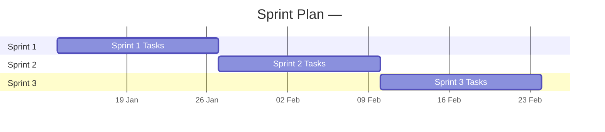

# Sprint Plan Template — <Project Name>

> Generated by: `/sprint` command  
> Source: WBS (`output/04-wbs-*.md`)

---

## Sprint Configuration

| Setting | Value |
|---------|-------|
| Project | <project-name> |
| Sprint Length | 2 weeks |
| Team Velocity | 40 SP/sprint |
| Buffer | 10% (4 SP reserved per sprint) |
| Start Date | <YYYY-MM-DD> |
| No. of Sprints | <N> |
| Total Story Points | <total from WBS> |

---

## Visual Timeline

---

## Sprint 1

**Sprint Goal:** <one-sentence goal>
**Dates:** <start> → <end>
**Capacity:** 36 SP (40 minus 4 buffer)

| Task ID | Task Name | Persona | SP | Dependencies |
|---------|-----------|---------|-----|-------------|
| WBS-xxx | | | | |

**Total SP:** 0  
**Definition of Done:**
- [ ] All tasks merged to `develop` branch
- [ ] Unit tests passing (≥ 80% coverage)
- [ ] Code reviewed and approved
- [ ] Deployed to Dev environment
- [ ] Acceptance criteria verified

**Sprint 1 Risks:**
- <risks from register that affect this sprint>

---

## Sprint 2

**Sprint Goal:** <one-sentence goal>
**Dates:** <start> → <end>
**Capacity:** 36 SP

| Task ID | Task Name | Persona | SP | Dependencies |
|---------|-----------|---------|-----|-------------|
| WBS-xxx | | | | |

**Total SP:** 0

---

## _(Repeat for each sprint)_

---

## Velocity Tracker

| Sprint | Planned SP | Completed SP | Velocity | Notes |
|--------|-----------|-------------|---------|-------|
| Sprint 1 | | | | |
| Sprint 2 | | | | |
| Sprint 3 | | | | |
| **Total** | | | | |

---

## Backlog (Not Yet Scheduled)

| Task ID | Task Name | Persona | SP | Reason for Deferral |
|---------|-----------|---------|-----|---------------------|
| | | | | |
