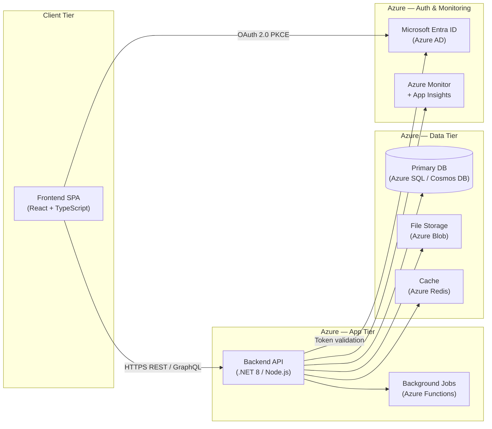
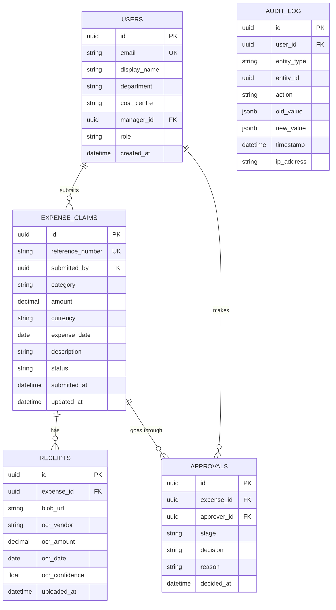
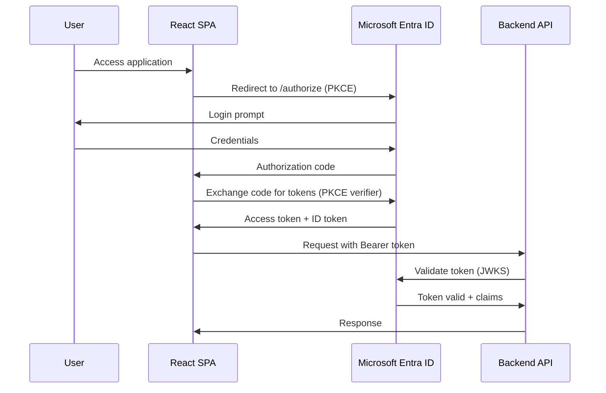
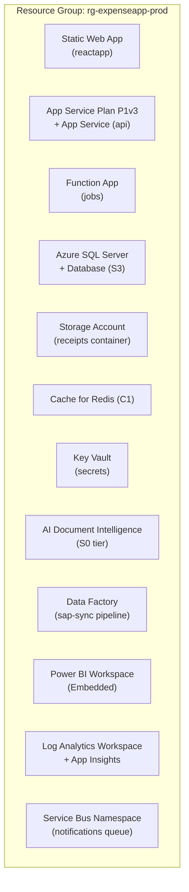
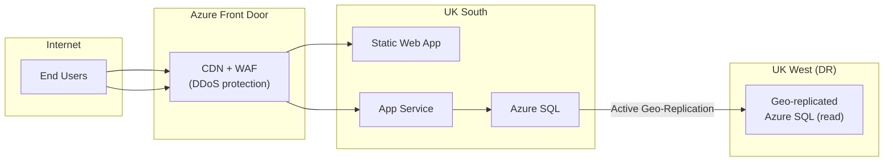
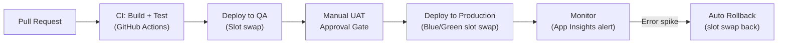

# Technical Design Document (TDD)
# Project: [PROJECT NAME]

| Field | Value |
|-------|-------|
| **Document Version** | 1.0 |
| **Date** | [DATE] |
| **Author** | Engineering Lead |
| **Status** | Draft |
| **FSD Reference** | `output/02-fsd-[project-name].md` |

---

## Table of Contents
1. [Architecture Overview](#1-architecture-overview)
2. [Tech Stack](#2-tech-stack)
3. [Component Breakdown](#3-component-breakdown)
4. [Database Design](#4-database-design)
5. [API Catalogue](#5-api-catalogue)
6. [Authentication & Authorisation](#6-authentication--authorisation)
7. [Azure Resource Map](#7-azure-resource-map)
8. [Non-Functional Design](#8-non-functional-design)
9. [Security Design](#9-security-design)
10. [Deployment Architecture](#10-deployment-architecture)
11. [CI/CD Pipeline](#11-cicd-pipeline)

---

## 1. Architecture Overview

### 1.1 High-Level System Architecture

### 1.2 Architecture Decisions

| Decision | Choice | Rationale |
|----------|--------|-----------|
| Frontend framework | [React / Angular / Vue] | [Reason] |
| Backend language | [.NET 8 / Node.js / Python] | [Reason] |
| Database | [Azure SQL / Cosmos DB] | [Reason — relational vs document] |
| Auth | Microsoft Entra ID | Enterprise SSO requirement (BRD-NFR-04) |
| Hosting | Azure App Service + Static Web Apps | Managed, scalable |

---

## 2. Tech Stack

| Layer | Technology | Version | Azure Service |
|-------|-----------|---------|---------------|
| Frontend | React + TypeScript | 18 / 5 | Azure Static Web Apps |
| Backend API | [.NET 8 Web API / Node.js Fastify] | [version] | Azure App Service (P1v3) |
| Background Jobs | [Azure Functions / Worker Service] | [version] | Azure Functions (Consumption) |
| Primary Database | [Azure SQL Database / Cosmos DB] | Latest | Azure SQL / Cosmos DB |
| File Storage | Azure Blob Storage | Latest | Azure Blob Storage (LRS) |
| Cache | Azure Cache for Redis | 7.x | Azure Cache for Redis (C1) |
| Auth | Microsoft Entra ID | Latest | Microsoft Entra ID |
| OCR / AI | Azure AI Document Intelligence | v4.0 | Azure AI Services |
| Analytics | Power BI Embedded | Latest | Power BI Premium |
| Data Integration | Azure Data Factory | Latest | Azure Data Factory |
| Observability | Application Insights + Log Analytics | Latest | Azure Monitor |
| Secrets | Azure Key Vault | Latest | Azure Key Vault |
| CI/CD | GitHub Actions | Latest | — |

---

## 3. Component Breakdown

### 3.1 Frontend (React SPA)

| Component | Responsibility | FSD Ref |
|-----------|---------------|---------|
| `AuthProvider` | Wraps MSAL for Entra ID auth, exposes user context | FSD-FR-01 |
| `ExpenseForm` | Controlled form for expense submission + OCR preview | FSD-FR-02, FR-03 |
| `ApprovalQueue` | Manager's list of pending approvals | FSD-FR-06 |
| `Dashboard` | Employee spend overview | FSD-FR-11 |
| `PowerBIEmbed` | Embedded Power BI report frame | FSD-FR-12 |
| `PolicyWarning` | Inline banner for policy violations | FSD-FR-04 |

**State Management:** [Redux Toolkit / Zustand / React Query + Context]  
**Routing:** React Router v6 — protected routes via auth guard  
**API Communication:** Axios with interceptors (attaches Bearer token)

### 3.2 Backend API

| Module | Responsibility | Routes |
|--------|---------------|--------|
| `AuthModule` | Token validation, user provisioning | `/api/auth/*` |
| `ExpenseModule` | CRUD for expense claims | `/api/expenses/*` |
| `ApprovalModule` | Approval workflow state machine | `/api/approvals/*` |
| `PolicyModule` | Policy rule evaluation engine | `/api/policies/*` |
| `ReportModule` | Data export (CSV/Excel) | `/api/reports/*` |
| `AdminModule` | System configuration | `/api/admin/*` |

### 3.3 Background Jobs (Azure Functions)

| Job | Trigger | Description |
|-----|---------|-------------|
| `SAPSyncJob` | Timer (daily 02:00 UTC) | Pulls employee data from SAP via ADF |
| `NotificationJob` | Service Bus queue | Sends email + push notifications |
| `OCRProcessingJob` | Blob trigger (new upload) | Calls Azure AI Document Intelligence |
| `AuditCleanupJob` | Timer (monthly) | Purges audit logs older than 7 years |

---

## 4. Database Design

### 4.1 Entity Relationship Diagram

### 4.2 Key Indexes

| Table | Index | Type | Reason |
|-------|-------|------|--------|
| `expense_claims` | `(submitted_by, status)` | Composite | Employee dashboard filter |
| `expense_claims` | `(status, submitted_at)` | Composite | Manager approval queue |
| `audit_log` | `(entity_type, entity_id)` | Composite | Entity history lookup |

---

## 5. API Catalogue

### Authentication

#### POST /api/auth/me
- **Auth**: Bearer token required
- **Description**: Returns current user profile and roles
- **Response (200)**: `{ id, email, displayName, role, department }`
- **Implements**: FSD-FR-01

---

### Expenses

#### POST /api/expenses
- **Auth**: Bearer token (Employee role)
- **Request**: `{ category, amount, currency, expenseDate, description }`
- **Response (201)**: `{ id, referenceNumber, status: "PENDING_MANAGER" }`
- **Response (422)**: `{ violations: [{ rule, message }] }` — policy violation
- **Implements**: FSD-FR-02, FSD-FR-04

#### GET /api/expenses
- **Auth**: Bearer token
- **Query params**: `?status=&from=&to=&page=&limit=`
- **Response (200)**: `{ data: [...], pagination: { total, page, limit } }`
- **Implements**: FSD-FR-11

#### GET /api/expenses/:id
- **Auth**: Bearer token (owner or approver)
- **Response (200)**: Full expense object including receipts and approval history
- **Response (403)**: If user is not owner or approver

#### PATCH /api/expenses/:id
- **Auth**: Bearer token (owner, only if status = DRAFT)
- **Implements**: FSD-FR-02

---

### Approvals

#### GET /api/approvals/queue
- **Auth**: Bearer token (Manager / Finance Controller role)
- **Response (200)**: `{ data: [expenseWithApplicantDetails], pagination }`
- **Implements**: FSD-FR-06

#### POST /api/approvals/:expenseId/decide
- **Auth**: Bearer token (Manager / Finance Controller role)
- **Request**: `{ decision: "APPROVED" | "REJECTED" | "MORE_INFO", reason?: string }`
- **Response (200)**: Updated expense object
- **Business rule**: `reason` is required when `decision = "REJECTED"`
- **Implements**: FSD-FR-06, FSD-FR-07

---

## 6. Authentication & Authorisation

### 6.1 Authentication Flow (OAuth 2.0 PKCE)

### 6.2 Role Claim Mapping

| Entra AD Group | Application Role | Permissions |
|----------------|-----------------|-------------|
| `all-employees` | Employee | Submit expenses, view own |
| `line-managers` | Manager | All Employee + approve team expenses |
| `finance-controllers` | FinanceController | All Manager + final approval |
| `finance-admins` | FinanceAdmin | Full access + export + admin |
| `system-admins` | SystemAdmin | Full access + system config |

---

## 7. Azure Resource Map

| Resource | SKU | Monthly Estimate | Purpose |
|----------|-----|-----------------|---------|
| Static Web App | Standard | £9 | React frontend hosting |
| App Service Plan | P1v3 | £130 | Backend API |
| Azure SQL Database | S3 | £120 | Primary data store |
| Azure Functions | Consumption | £5–20 | Background jobs |
| Storage Account | LRS | £10–30 | Receipt storage |
| Redis Cache | C1 | £55 | API response cache |
| Key Vault | Standard | £5 | Secrets management |
| AI Document Intelligence | S0 | Pay-per-use | OCR processing |
| Azure Data Factory | On-demand | £10–40 | SAP HR sync |
| Service Bus | Standard | £9 | Notification queue |
| Azure Monitor | Pay-per-use | £20–50 | Observability |

---

## 8. Non-Functional Design

### 8.1 Caching Strategy
| Data | Cache TTL | Cache Key |
|------|-----------|-----------|
| User profile + roles | 15 minutes | `user:{userId}` |
| Policy rules config | 60 minutes | `policy:rules` |
| Approval queue count | 1 minute | `queue:{managerId}` |

### 8.2 Rate Limiting
| Endpoint | Limit | Window |
|----------|-------|--------|
| `POST /api/auth/*` | 10 requests | 1 minute per IP |
| `POST /api/expenses` | 20 requests | 1 minute per user |
| `POST /api/approvals/*/decide` | 60 requests | 1 minute per user |

### 8.3 Retry Policy (HTTP client to external services)
- Max 3 retries with exponential back-off: 1s, 2s, 4s
- Circuit breaker: open after 5 failures in 30s, reset after 60s

---

## 9. Security Design

| OWASP Category | Mitigation |
|---------------|-----------|
| A01 Broken Access Control | JWT claims checked on every request; row-level security in DB |
| A02 Cryptographic Failures | TLS 1.2+ in transit; AES-256 at rest; Key Vault for all secrets |
| A03 Injection | Parameterised queries (EF Core / Dapper); input sanitisation |
| A04 Insecure Design | Threat model reviewed; approval workflow with state machine |
| A05 Security Misconfiguration | Infrastructure as Code (Bicep); no default credentials |
| A07 Auth Failures | Entra ID SSO only; no local passwords; PKCE flow |
| A08 Data Integrity | Immutable audit log; signed receipts in Blob Storage |
| A10 SSRF | Outbound firewall rules; internal URLs validated server-side |

---

## 10. Deployment Architecture

---

## 11. CI/CD Pipeline

**Branch Strategy:** Trunk-based development
- `main` → deploys to Production (requires PR + 1 review + CI pass)
- `develop` → deploys to QA slot (auto on merge)
- Feature branches → PR to `develop`

---

*Generated by GitHub Copilot PM Spec-Kit*
