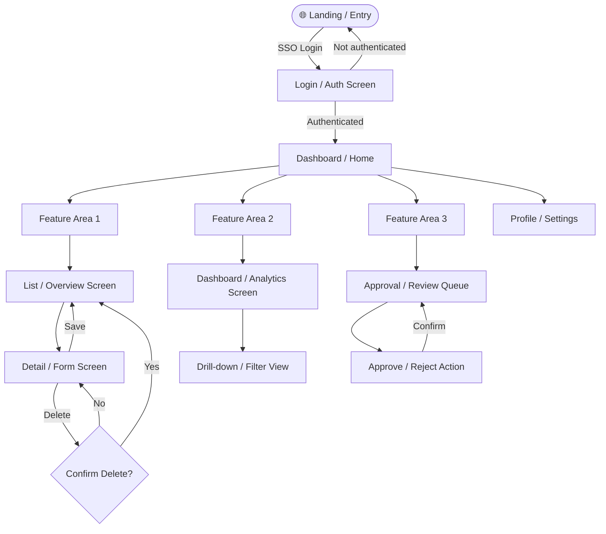

# UI Prototype
# Project: [PROJECT NAME]

| Field | Value |
|-------|-------|
| **Version** | 1.0 |
| **Date** | [DATE] |
| **FSD Reference** | `output/02-fsd-[project-name].md` |
| **HTML Prototype** | `output/06-ui-prototype-[project-name].html` |

---

## Layer 1 — User Flow Diagram



---

## Layer 2 — Screen Wireframes

---

### Screen 1: Login / Authentication

```
┌─────────────────────────────────────────────────────────┐
│  SCREEN: Login                            [v1.0]         │
├─────────────────────────────────────────────────────────┤
│                                                           │
│         ┌───────────────────────────────────────┐        │
│         │     🏢  [Company / App Logo]           │        │
│         │     [Application Name]                 │        │
│         └───────────────────────────────────────┘        │
│                                                           │
│    Email Address                                          │
│    ┌───────────────────────────────────────────┐         │
│    │  user@company.com                         │         │
│    └───────────────────────────────────────────┘         │
│                                                           │
│    Password                              [Forgot pwd?]   │
│    ┌───────────────────────────────────────────┐         │
│    │  ••••••••••••••••••  [👁 Show / Hide]    │         │
│    └───────────────────────────────────────────┘         │
│                                                           │
│    ┌───────────────────────────────────────────┐         │
│    │              SIGN IN  →                  │         │  ← Primary CTA (disabled until fields filled)
│    └───────────────────────────────────────────┘         │
│                                                           │
│    ──────────── Or continue with ─────────────           │
│                                                           │
│    ┌──────────────────┐   ┌──────────────────┐           │
│    │  🪟  Microsoft   │   │  🔵  Entra ID    │           │
│    └──────────────────┘   └──────────────────┘           │
│                                                           │
│    [Error banner — hidden by default]                     │
│    ⚠️  Invalid email or password. (3 attempts remaining)  │
│                                                           │
└─────────────────────────────────────────────────────────┘
Notes:
- On 3 failed attempts → show "Account Locked" state, hide form
- "Forgot Password?" triggers SSO-based reset flow
- Microsoft SSO button → triggers MSAL PKCE flow
```

---

### Screen 2: Dashboard / Home

```
┌─────────────────────────────────────────────────────────┐
│  [App Name]           [🔔 3]  [👤 John Smith ▼]  LOGOUT │
├──────────┬──────────────────────────────────────────────┤
│ NAV      │  DASHBOARD                                    │
│          │                                               │
│ 🏠 Home  │  Welcome back, John!   Today: 23 Mar 2026    │
│          │                                               │
│ 📋 [F1] │  ┌───────────┐ ┌───────────┐ ┌───────────┐  │
│          │  │  Metric 1  │ │  Metric 2  │ │  Metric 3  │  │
│ ✅ [F2] │  │  £ 4,230  │ │    12     │ │    3      │  │
│          │  │  This Mth │ │  Pending  │ │  Approved │  │
│ 📊 [F3] │  └───────────┘ └───────────┘ └───────────┘  │
│          │                                               │
│ ⚙️ Admin │  RECENT ACTIVITY                             │
│          │  ┌──────────────────────────────────────────┐│
│          │  │ EXP-001  £ 47.50   Meals    ⏳ Pending  ││
│          │  │ EXP-002  £ 120.00  Travel   ✅ Approved ││
│          │  │ EXP-003  £ 8.90    Taxi     💰 Paid     ││
│          │  │                    [ View All →  ]       ││
│          │  └──────────────────────────────────────────┘│
│          │                                               │
│          │  NOTIFICATIONS                                │
│          │  🔔 "Your claim EXP-001 is pending review"   │
│          │  🔔 "EXP-002 was approved by J. Manager"     │
└──────────┴──────────────────────────────────────────────┘
Notes:
- Left nav: collapsible on mobile (hamburger)
- Metric cards: clickable, navigate to filtered lists
- Recent activity: most recent 5 items
```

---

### Screen 3: Primary Feature Form (e.g., Submit Expense)

```
┌─────────────────────────────────────────────────────────┐
│  [App Name]           [🔔]    [👤 John Smith]            │
├──────────┬──────────────────────────────────────────────┤
│ NAV      │  NEW EXPENSE CLAIM          [← Back]          │
│          ├──────────────────────────────────────────────┤
│          │                                               │
│          │  ┌──────────────────────────────────────────┐│
│          │  │ 📎 UPLOAD RECEIPT (drag & drop)          ││
│          │  │                                           ││
│          │  │    [ Click to upload or drag here ]      ││
│          │  │    JPG, PNG, PDF — max 5MB               ││
│          │  │                                           ││
│          │  │ ✅ receipt.jpg uploaded                  ││
│          │  │ 🤖 OCR: "Costa Coffee  £6.50  14/03"     ││  ← auto-filled
│          │  └──────────────────────────────────────────┘│
│          │                                               │
│          │  Category *       Date *                      │
│          │  [Meals      ▼]   [14/03/2026    📅]         │
│          │                                               │
│          │  Amount *         Currency                    │
│          │  [     6.50   ]   [GBP ▼]                    │
│          │                                               │
│          │  Description *                                │
│          │  ┌──────────────────────────────────────────┐│
│          │  │ Team coffee during standup                ││
│          │  └──────────────────────────────────────────┘│
│          │                                               │
│          │  ⚠️ POLICY CHECK                             │
│          │  ┌──────────────────────────────────────────┐│
│          │  │ ✅ Within daily meals limit (£50)        ││
│          │  └──────────────────────────────────────────┘│
│          │                                               │
│          │  [  SAVE DRAFT  ]      [  SUBMIT CLAIM  →  ] │
└──────────┴──────────────────────────────────────────────┘
Notes:
- OCR fills fields automatically after upload
- Policy engine validates in real-time (< 200ms via API)
- SUBMIT disabled until all * fields complete + no hard violations
- On submit: show success banner with claim reference number
```

---

### Screen 4: Approval Queue (Manager View)

```
┌─────────────────────────────────────────────────────────┐
│  [App Name]           [🔔 5]   [👤 Jane Manager]         │
├──────────┬──────────────────────────────────────────────┤
│ NAV      │  APPROVAL QUEUE                               │
│          │                                               │
│ 🏠 Home  │  Filter: [All Status ▼]  [All Deptmts ▼]    │
│          │  Sort by: [Date Submitted ▼]  [ 🔽 Oldest ]  │
│ ✅ Queue │                                               │
│  (5)     │  ┌──────────────────────────────────────────┐│
│          │  │ EXP-2026-00145   John Smith              ││
│ 📊 Dash  │  │ Meals · £47.50 · 14 Mar 2026             ││
│          │  │ "Team lunch after sprint demo"            ││
│          │  │ [📄 View Receipt]   [APPROVE ✅] [REJECT ❌]││
│          │  ├──────────────────────────────────────────┤│
│          │  │ EXP-2026-00143   Sarah Jones             ││
│          │  │ Travel · £112.00 · 12 Mar 2026           ││
│          │  │ "Train to client site"                    ││
│          │  │ [📄 View Receipt]   [APPROVE ✅] [REJECT ❌]││
│          │  ├──────────────────────────────────────────┤│
│          │  │ EXP-2026-00141   ⚠️ Mark Davis            ││
│          │  │ Electronics · £450.00 · 10 Mar 2026      ││
│          │  │ "Keyboard" · ⚠️ Requires pre-approval    ││
│          │  │ [📄 View Receipt]   [APPROVE ✅] [REJECT ❌]││
│          │  └──────────────────────────────────────────┘│
│          │                                               │
│          │  Showing 3 of 5 pending   [ Load more... ]   │
└──────────┴──────────────────────────────────────────────┘
Notes:
- Policy violations flagged with ⚠️ amber warning
- Reject action opens modal requiring mandatory reason text
- "Request More Info" option available in expanded card view
```

---

## HTML Prototype

The clickable HTML prototype is saved as:
`output/06-ui-prototype-[project-name].html`

It covers:
1. **Login Screen** — with SSO button + form validation
2. **Dashboard** — metric cards + recent activity list
3. **Submit Expense Form** — with mock OCR auto-fill + policy check
4. **Approval Queue** — manager's pending items list
5. **Navigation** — left sidebar that links all screens

Open the `.html` file directly in any browser — no server required.

---

*Generated by GitHub Copilot PM Spec-Kit*
