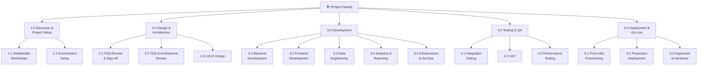

# Work Breakdown Structure (WBS)
# Project: [PROJECT NAME]

| Field | Value |
|-------|-------|
| **Document Version** | 1.0 |
| **Date** | [DATE] |
| **Author** | Project Manager |
| **FSD Reference** | `output/02-fsd-[project-name].md` |
| **TDD Reference** | `output/03-tdd-[project-name].md` |
| **Total Estimated Effort** | [X] Story Points |
| **Estimated Duration** | [X] weeks |
| **Team Size** | [X] engineers |

---

## WBS Visual Tree

---

## Phase 1: Discovery & Project Setup

| Task ID | Task | Persona | Est. (SP) | FSD/TDD Ref | Dependencies |
|---------|------|---------|-----------|-------------|-------------|
| WBS-101 | Stakeholder kickoff workshop | PM | 2 | — | — |
| WBS-102 | Requirements sign-off session | PM | 1 | BRD | — |
| WBS-103 | Set up GitHub repo, branch strategy, PR templates | SRE/Cloud | 2 | — | — |
| WBS-104 | Provision Dev + QA Azure environments (Bicep) | SRE/Cloud | 3 | TDD-7 | WBS-103 |
| WBS-105 | Configure Entra ID app registrations | SRE/Cloud | 2 | TDD-6 | WBS-104 |
| WBS-106 | Set up CI/CD pipeline skeleton (GitHub Actions) | SRE/Cloud | 3 | TDD-11 | WBS-103 |
| WBS-107 | Configure Azure Monitor + App Insights | SRE/Cloud | 2 | — | WBS-104 |

**Phase 1 Subtotal:**

| Persona | Story Points |
|---------|-------------|
| PM | 3 |
| SRE / Cloud Engineer | 12 |
| **Phase Total** | **15** |

---

## Phase 2: Design & Architecture

| Task ID | Task | Persona | Est. (SP) | FSD/TDD Ref | Dependencies |
|---------|------|---------|-----------|-------------|-------------|
| WBS-201 | FSD review and sign-off with stakeholders | PM + FE + BE | 3 | FSD | WBS-102 |
| WBS-202 | TDD review and architecture decision record | BE | 3 | TDD | WBS-201 |
| WBS-203 | Database schema design and peer review | BE + DE | 5 | TDD-4 | WBS-202 |
| WBS-204 | API contract definition (OpenAPI spec) | BE | 3 | TDD-5 | WBS-202 |
| WBS-205 | UI wireframes for all screens | FE | 5 | FSD-4 | WBS-201 |
| WBS-206 | Design system / component library setup | FE | 3 | — | — |
| WBS-207 | Data model design (warehouse / Fabric) | DE | 3 | TDD-4 | WBS-203 |
| WBS-208 | Power BI workspace setup and report design | DA | 3 | FSD-FR-12 | WBS-207 |

**Phase 2 Subtotal:**

| Persona | Story Points |
|---------|-------------|
| Frontend Engineer | 8 |
| Backend Engineer | 11 |
| Data Engineer | 8 |
| Data Analyst | 3 |
| **Phase Total** | **30** |

---

## Phase 3: Development

### 3.1 Backend Development

| Task ID | Task | Persona | Est. (SP) | FSD/TDD Ref | Dependencies |
|---------|------|---------|-----------|-------------|-------------|
| WBS-311 | Auth middleware (Entra ID JWT validation) | BE | 3 | FSD-FR-01, TDD-6 | WBS-105 |
| WBS-312 | User profile & role seeding | BE | 2 | FSD-FR-14 | WBS-311 |
| WBS-313 | Expense CRUD API + validation | BE | 5 | FSD-FR-02 | WBS-204 |
| WBS-314 | Policy engine (rule evaluation) | BE | 8 | FSD-FR-04 | WBS-313 |
| WBS-315 | Approval workflow state machine | BE | 8 | FSD-FR-06, FR-07 | WBS-313 |
| WBS-316 | Notification service (email + in-app) | BE | 5 | FSD-FR-09 | WBS-315 |
| WBS-317 | Audit log middleware | BE | 3 | FSD-FR-10 | WBS-311 |
| WBS-318 | File upload API (Blob Storage) | BE | 3 | FSD-FR-15 | WBS-104 |
| WBS-319 | OCR integration (AI Document Intelligence) | BE | 5 | FSD-FR-03 | WBS-318 |
| WBS-320 | Data export API (CSV/Excel) | BE | 3 | FSD-FR-16 | WBS-313 |
| WBS-321 | Admin configuration API | BE | 3 | FSD-FR-17 | WBS-312 |
| WBS-322 | Unit tests — backend (≥ 80% coverage) | BE | 5 | — | WBS-321 |

### 3.2 Frontend Development

| Task ID | Task | Persona | Est. (SP) | FSD/TDD Ref | Dependencies |
|---------|------|---------|-----------|-------------|-------------|
| WBS-331 | MSAL auth integration + protected routing | FE | 3 | FSD-FR-01, TDD-6 | WBS-311 |
| WBS-332 | Login + SSO redirect screen | FE | 2 | FSD-FR-01 | WBS-331 |
| WBS-333 | Expense submission form + OCR preview | FE | 8 | FSD-FR-02, FR-03 | WBS-319 |
| WBS-334 | Policy violation warning banner | FE | 2 | FSD-FR-04 | WBS-314 |
| WBS-335 | Employee dashboard (my expenses) | FE | 5 | FSD-FR-11 | WBS-313 |
| WBS-336 | Manager approval queue screen | FE | 5 | FSD-FR-06 | WBS-315 |
| WBS-337 | Notification centre (in-app bell) | FE | 3 | FSD-FR-09 | WBS-316 |
| WBS-338 | Power BI embed component | FE | 3 | FSD-FR-12 | WBS-208 |
| WBS-339 | Admin settings screens | FE | 3 | FSD-FR-17 | WBS-321 |
| WBS-340 | Responsive layout + accessibility (WCAG) | FE | 5 | BRD-NFR-06 | WBS-206 |
| WBS-341 | Unit + component tests (≥ 80% coverage) | FE | 5 | — | WBS-340 |

### 3.3 Data Engineering

| Task ID | Task | Persona | Est. (SP) | FSD/TDD Ref | Dependencies |
|---------|------|---------|-----------|-------------|-------------|
| WBS-351 | Azure SQL schema migrations (liquibase/EF) | DE | 5 | TDD-4 | WBS-203 |
| WBS-352 | ADF pipeline — SAP HR daily sync | DE | 8 | FSD-FR-13 | WBS-104 |
| WBS-353 | Fabric workspace + data lakehouse setup | DE | 5 | TDD-7 | WBS-104 |
| WBS-354 | Expense data model in Fabric (star schema) | DE | 5 | TDD-4 | WBS-353 |
| WBS-355 | Data quality rules and pipeline alerts | DE | 3 | — | WBS-352 |

### 3.4 Analytics & Reporting

| Task ID | Task | Persona | Est. (SP) | FSD/TDD Ref | Dependencies |
|---------|------|---------|-----------|-------------|-------------|
| WBS-361 | Power BI semantic model + DAX measures | DA | 5 | FSD-FR-12 | WBS-354 |
| WBS-362 | Spend overview dashboard report | DA | 5 | FSD-FR-12 | WBS-361 |
| WBS-363 | Policy violations report | DA | 3 | FSD-FR-12 | WBS-361 |
| WBS-364 | Embedded report token / RLS (row-level security) | DA | 3 | FSD-FR-14 | WBS-362 |

### 3.5 Infrastructure & DevOps

| Task ID | Task | Persona | Est. (SP) | FSD/TDD Ref | Dependencies |
|---------|------|---------|-----------|-------------|-------------|
| WBS-371 | Production Azure Bicep templates | SRE/Cloud | 8 | TDD-7 | WBS-104 |
| WBS-372 | Key Vault secrets rotation policy | SRE/Cloud | 2 | TDD-9 | WBS-371 |
| WBS-373 | Azure Front Door + WAF policy | SRE/Cloud | 3 | TDD-10 | WBS-371 |
| WBS-374 | CI/CD — full pipeline with slot swap | SRE/Cloud | 5 | TDD-11 | WBS-106 |
| WBS-375 | Azure Monitor alert rules | SRE/Cloud | 3 | — | WBS-107 |

---

## Phase 4: Testing & QA

| Task ID | Task | Persona | Est. (SP) | FSD/TDD Ref | Dependencies |
|---------|------|---------|-----------|-------------|-------------|
| WBS-401 | Integration test suite (API + DB) | BE | 5 | — | WBS-322 |
| WBS-402 | E2E test suite (Playwright / Cypress) | FE | 5 | — | WBS-341 |
| WBS-403 | Performance / load testing | SRE/Cloud | 3 | BRD-NFR-01 | WBS-401 |
| WBS-404 | Security penetration test (OWASP scan) | SRE/Cloud | 3 | BRD-NFR-04 | WBS-401 |
| WBS-405 | UAT with Finance team (3 cycles) | PM | 5 | — | WBS-402 |
| WBS-406 | Bug fix sprint post-UAT | FE + BE | 5 | — | WBS-405 |
| WBS-407 | Data accuracy validation (Power BI) | DA + DE | 3 | FSD-FR-12 | WBS-405 |

---

## Phase 5: Deployment & Go-Live

| Task ID | Task | Persona | Est. (SP) | FSD/TDD Ref | Dependencies |
|---------|------|---------|-----------|-------------|-------------|
| WBS-501 | Production Azure provisioning | SRE/Cloud | 5 | TDD-7 | WBS-371 |
| WBS-502 | Production secrets seeding (Key Vault) | SRE/Cloud | 2 | — | WBS-501 |
| WBS-503 | Production deployment + smoke tests | SRE/Cloud + BE | 3 | — | WBS-502 |
| WBS-504 | SAP integration smoke test (prod) | DE | 2 | FSD-FR-13 | WBS-503 |
| WBS-505 | User training — Finance team (2 sessions) | PM | 3 | — | WBS-503 |
| WBS-506 | Go-Live decision checkpoint | PM | 1 | — | WBS-505 |
| WBS-507 | Hypercare support (2 weeks) | BE + SRE | 5 | — | WBS-506 |
| WBS-508 | Runbook and handover documentation | SRE/Cloud | 3 | — | WBS-507 |

---

## Effort Summary

| Persona | Ph 1 | Ph 2 | Ph 3 | Ph 4 | Ph 5 | **Total** |
|---------|------|------|------|------|------|---------|
| Frontend Engineer | 0 | 8 | 41 | 10 | 0 | **59** |
| Backend Engineer | 0 | 14 | 50 | 15 | 3 | **82** |
| Data Engineer | 0 | 11 | 21 | 3 | 2 | **37** |
| Data Analyst | 0 | 3 | 16 | 3 | 0 | **22** |
| SRE / Cloud Engineer | 12 | 0 | 21 | 6 | 18 | **57** |
| PM | 3 | 3 | 0 | 5 | 4 | **15** |
| **Total** | **15** | **39** | **149** | **42** | **27** | **272** |

> Assuming avg velocity of 30 SP per sprint (2-week), estimated duration: **~18 weeks**

---

*Generated by GitHub Copilot PM Spec-Kit*
